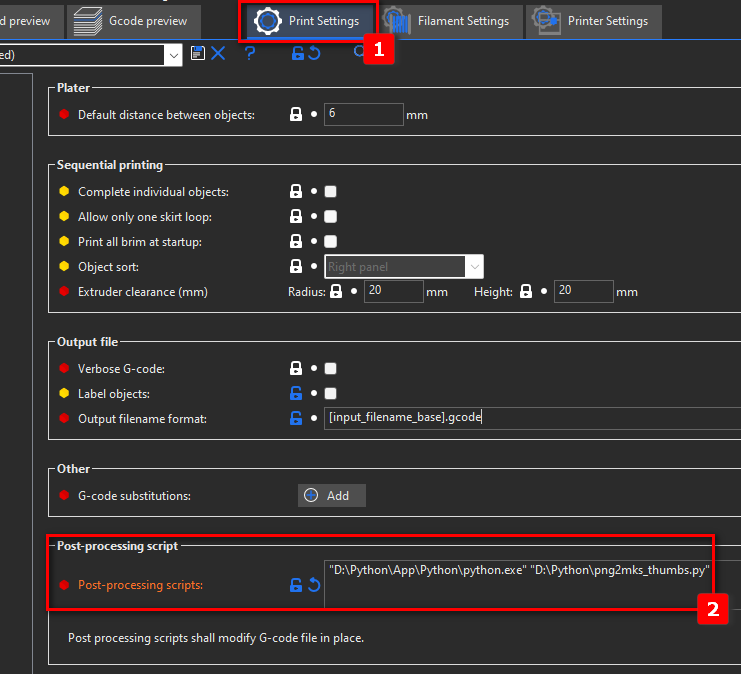
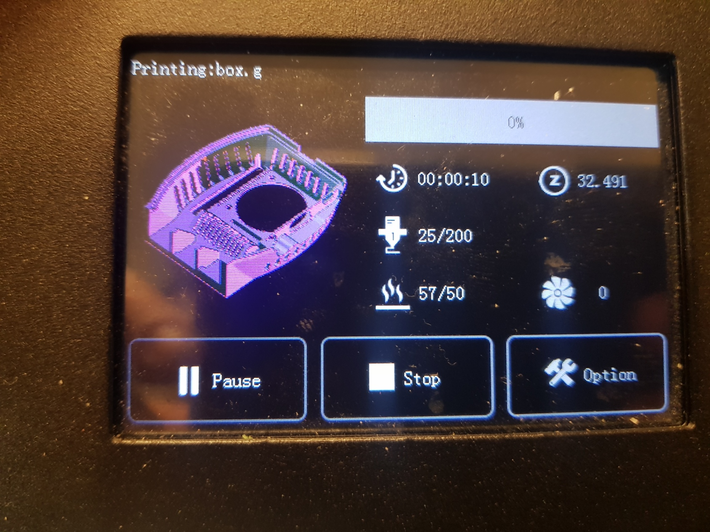

# MKS-Thumbs-for-Prusa-Super-Slicer
Optimized for Wanaho D12 printer

Python script converting GCODE containing PNG previews into MKS compatible previews (Wanhao D12, etc).

Configuration required in the slicer:

- Print Settings > Output Options > Post-processing script : "PythonPath\python.exe" "PythonScript\png2mks_thumbs.py"

- Printer Settings > Thumbnails >
  - Size for Gcode
    - Small: x: 100 y: 100
    - Big: x: 200 y: 200
  - Thumbnail option
    - Format of G-code thumbnails: PNG
    - Bed on thumbnail: None

At each slicing, the script will automatically start replacing all the previews so that they are correctly read by the printer :

As you seen, the color is not quite accurate for the large thumbnail, and I haven't found what needs to be done even by modifying the order of the RGB channels, swapping, etc. It's not a big problem for now.
